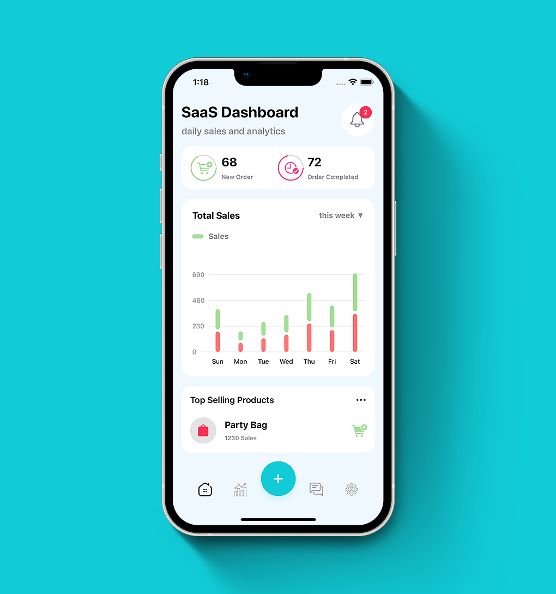

# SaaS Dashboard UI

SaaS Dashboard App UI With Stylish Bar Graphs using SwiftUi 3.0 🤓

[](https://opensource.org/licenses/Apache-2.0)
[](https://github.com/shameemreza/SaaSDashboard/blob/main/LICENSE)


## Video Preview

[](https://youtu.be/dBDAIMmoJUU "SaaS Dashboard UI")

## Screenshots




## Features

* Custom Bar Graph
* Custom Tab Bar
* Data in Graph View
* SwiftUI Graphs
* SwiftUI Analytics UI
* SwiftUI Overlay
* SwiftUI Complex UI
* SwiftUI for iOS 15

Thanks for the Guide: [Balaji Venkatesh](https://kavsoft.dev)

Dribble Shot 👉 [Click Here](https://dribbble.com/shots/17731615-SaaS-Dashboard-App-UI-With-Stylish-Bar-Graphs)

## License

```
Copyright 2022 Shameem Reza

Licensed under the Apache License, Version 2.0 (the "License");
you may not use this file except in compliance with the License.
You may obtain a copy of the License at

   http://www.apache.org/licenses/LICENSE-2.0

Unless required by applicable law or agreed to in writing, software
distributed under the License is distributed on an "AS IS" BASIS,
WITHOUT WARRANTIES OR CONDITIONS OF ANY KIND, either express or implied.
See the License for the specific language governing permissions and
limitations under the License.
```
